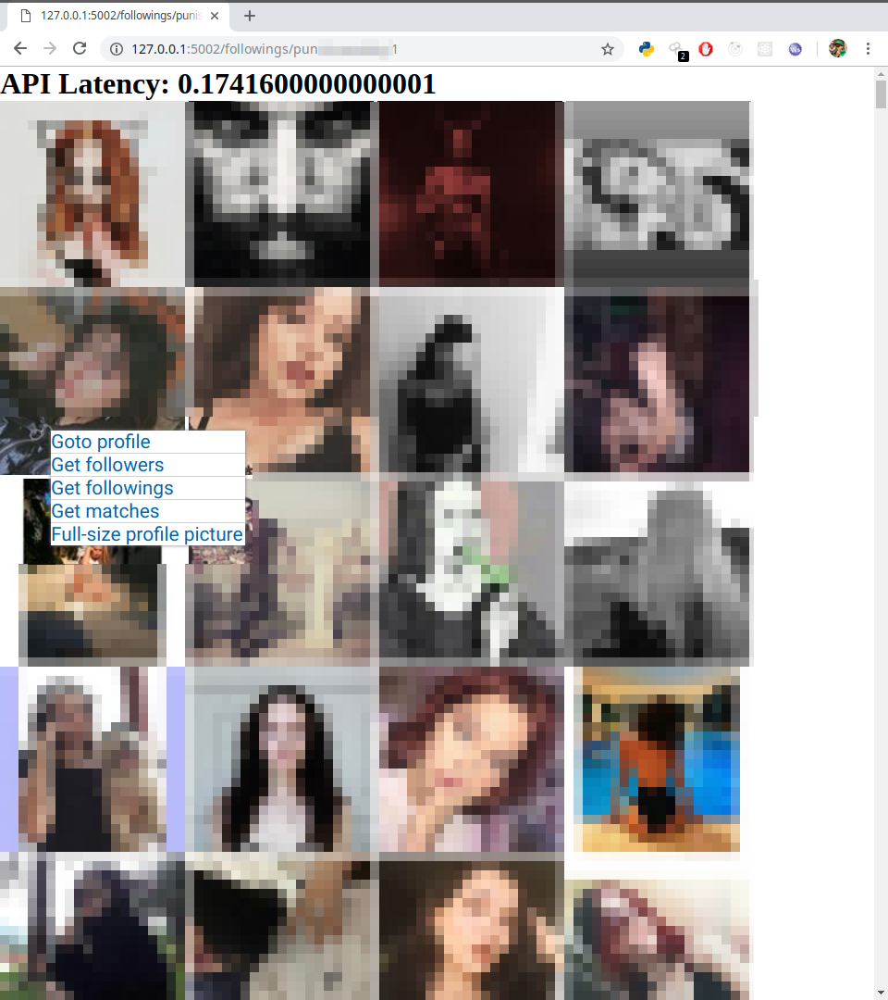

# Pervertgram

A weekend project from a cyber-pervert.

## Get followers/Followings/Matches


```
http://localhost:5002/followings/<victim> or
http://localhost:5002/followings/<victim>/<int:rend> or
http://localhost:5002/followings/<victim>/<int:rend>/<int:getAll>
```
```
http://localhost:5002/followers/<victim> or
http://localhost:5002/followers/<victim>/<int:rend> or
http://localhost:5002/followers/<victim>/<int:rend>/<int:getAll> 
```
```
http://localhost:5002/match/<victim> or
http://localhost:5002/match/<victim>/<int:rend>
```

## Get HD Profile Picture


```
http://localhost:5002/dp/<victim>
```
## Draw heatmap from users location 


```
http://localhost:5002/dp/heatmap/<victim> or
http://localhost:5002/dp/heatmap/<victim>/<int:rend>
```
## Others

### Get photos from the given location

```
http://localhost:5002/dp/location/<int:location> or
http://localhost:5002/dp/location/<int:location>/<int:rend> or
http://localhost:5002/dp/location/<int:location>/<int:rend>/<int:getAll>
```

### Get people from the given location

```
http://localhost:5002/dp/location-people/<int:location> or
http://localhost:5002/dp/location-people/<int:location>/<int:rend> or
http://localhost:5002/dp/location-people/<int:location>/<int:rend>/<int:getAll>
```

### Params
```
rend = 0 => returns json data
rend = 1 => returns rendered html file
rend = 2 => returns raw dictionary data(for internal work)
```

```
getAll = 0 => returns first page of data
getAll = 1 => returns all the data
```

### config.json

```json
{
    "username": "exampleUser",
    "pwd": "examplePassword"
}

```